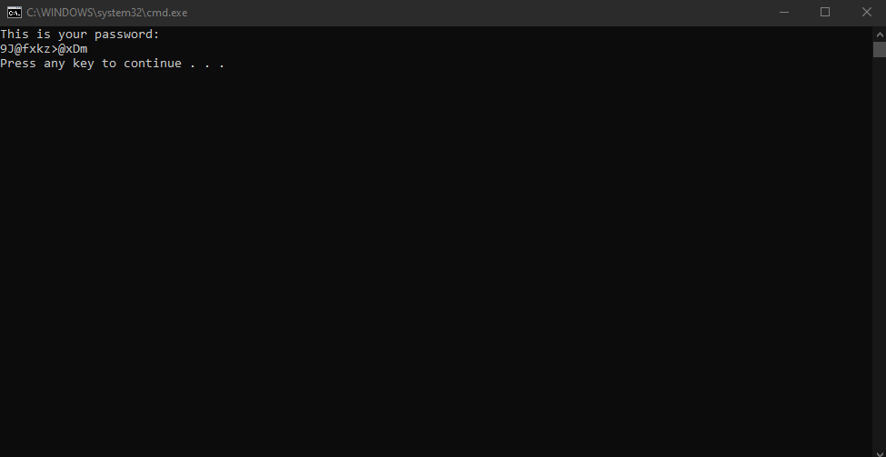

# Password Generator
This program generates a password
## Visual demonstration

## Pseudocode
1. Make arrays of numbers (0 - 9), lowercase alphabet, uppercase alphabet and symbols
2. Use random to so select at least one character from each of array
3. Combine all the arrays and store in a variable
4. Use `random.choice` to select from wach array and store in a temp
5. join the temp and the combined list, `tmp_list`
6. convert `tmp_list` into an array and shuffle
7. traverse array
8. print password